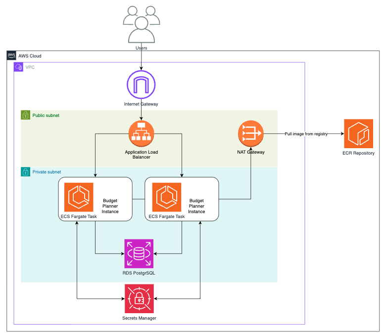
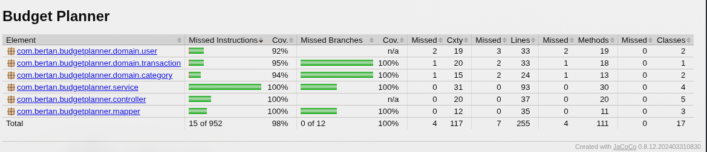

# Budget Planner

API REST para controle de finanças pessoais: registra receitas e despesas, organiza por categoria e mostra resumos (saldo, mensal, por categoria).

## Problema que resolve

Substitui planilha manual por uma API simples que centraliza transações financeiras e calcula saldo/resumos automaticamente, com histórico paginado e categorização.

## Tecnologias

Java 21 · Spring Boot 4 · PostgreSQL 16 · Flyway · Maven · Docker · Terraform (AWS)

## Rodando local com Docker Compose

```bash
cp .env.example .env
# edite .env com as credenciais do banco
docker compose up --build
```

API disponível em `http://localhost:8080`.

## Rodando local com Maven (sem Docker)

```bash
createdb budget-planner

export DB_URL=jdbc:postgresql://localhost:5432/budget-planner
export DB_USER=postgres
export DB_PASSWORD=postgres

./mvnw spring-boot:run
```

## Deploy na AWS com Terraform

Infraestrutura: ECR + ECS Fargate + RDS Postgres + ALB, gerenciada em `infra/`. O setup inicial é feito via Terraform; a partir daí, cada push em `main` aciona o pipeline de CI/CD (`.github/workflows/ci-cd.yml`), que builda, testa, publica a imagem no ECR e atualiza o serviço ECS automaticamente.



Guia completo passo a passo na [documentação de Deploy](docs/deploy.md).

Pipeline de CI/CD (build, deploy do app e plan/apply da infra) documentado em [documentação de Pipelines](docs/ci-cd.md).

## Observabilidade

Logs do container, alarme de erros 5xx no ALB com notificação via SNS e um dashboard centralizando as métricas de ECS, ALB e RDS.


Detalhes em [documentação de Observabilidade](docs/observability.md).

## Decisões Técnicas

### Por que OIDC e não Access Key no CI/CD?

O pipeline de CD autentica na AWS via OIDC em vez de um Access Key fixo guardado como secret. O Access Key, uma vez salvo, fica válido indefinidamente até ser revogado manualmente, então se vazar o risco persiste até alguém notar. O OIDC troca um token temporário emitido pelo GitHub por credenciais da AWS que expiram em minutos, geradas a cada execução, sem nenhum segredo fixo armazenado, além de permitir restringir via trust policy quem pode assumir a IAM Role (ex: só a branch `main` deste repositório).

Resumo: OIDC foi escolhido pela ausência de segredo de longa duração e por restringir o acesso por repositório e branch, sendo também a prática hoje recomendada pela AWS e pelo GitHub.

### Por que JWT stateless e não sessão?

Cada request autenticada carrega um token JWT (HMAC256), validado a cada chamada por um filtro próprio (`SecurityFilter`) antes de chegar aos controllers, sem sessão guardada em lugar nenhum. Isso evita sticky session ou um store de sessão compartilhado entre as instâncias do ECS quando a API escala horizontalmente atrás do ALB, e mantém a autenticação no mesmo modelo do resto da infra, que já é stateless (com exceção do RDS).

Senha nunca é salva em texto puro, vai hash com BCrypt. Só `/auth/register` e `/auth/login` ficam abertos, todo o resto exige um Bearer token válido no header `Authorization`.

### Isolamento de dados por usuário

O `userId` vem dentro do JWT, e cada usuário só enxerga (e só altera) as próprias transações e o próprio saldo. Isso é feito na query, não com um filtro aplicado depois de buscar tudo no banco. Quem tem papel `ADMIN` foge dessa regra e vê os dados de qualquer usuário.

### Rate limiting no login

`POST /auth/login` tem limite de 5 tentativas por minuto por IP (Bucket4j, token bucket), retornando 429 quando estoura. O número segue a referência do OWASP Authentication Cheat Sheet, e a chave escolhida foi o IP (via `X-Forwarded-For`, já que a API roda atrás do ALB), não o username: mais simples de implementar e já corta um brute-force na prática, ao custo de permitir que um mesmo IP tente contra usuários diferentes sem ser bloqueado por conta.

O estado dos buckets fica em memória (`ConcurrentHashMap`), não em Redis. Como o ECS roda mais de uma instância atrás do ALB, isso significa que o limite é por instância: um atacante que bater em instâncias diferentes na rotação do load balancer pode, na prática, ter mais tentativas do que as 5 previstas. Pra um projeto deste tamanho o trade-off compensa, resolver isso direito exigiria um backend compartilhado (ElastiCache/Redis), que é o passo natural se o rate limiting precisar valer de forma exata entre instâncias.

## Testes

Dois níveis de teste, separados por sufixo (`*Test` vs `*IT`):

- **Unitários** - `domain`, `service` e `mapper` testados isoladamente (JUnit 5 + Mockito), sem subir contexto Spring.
- **Integração** - `*ControllerIT` sobem o contexto Spring completo (`@SpringBootTest`, porta aleatória) e usam [Testcontainers](https://testcontainers.com/) para provisionar um PostgreSQL real em container a cada execução, eliminando divergência entre teste e banco de produção. As chamadas HTTP aos endpoints são feitas com [REST Assured](https://rest-assured.io/). Cada teste limpa as tabelas (`TRUNCATE ... RESTART IDENTITY CASCADE`) no `@AfterEach` para isolamento entre casos.

Cobertura medida com JaCoCo (`mvn verify`), excluindo pacotes de `dto`, `exception` e `config`:



## Documentação da API

A documentação completa dos endpoints está disponível via Swagger em `http://localhost:8080/swagger-ui/index.html`.

## Endpoints principais

- `GET /api/v1/health`: status da API
- `POST /api/v1/auth/register`: cria usuário
- `POST /api/v1/auth/login`: autentica e retorna token JWT
- `GET/POST/PUT/DELETE /api/v1/categories`: categorias (tipo `INCOME` ou `EXPENSE`)
- `GET/POST/PUT/DELETE /api/v1/transactions`: transações (paginado)
- `GET /api/v1/summary/balance`: saldo geral
- `GET /api/v1/summary/monthly?month=&year=`: resumo mensal
- `GET /api/v1/summary/categories?month=&year=`: totais por categoria