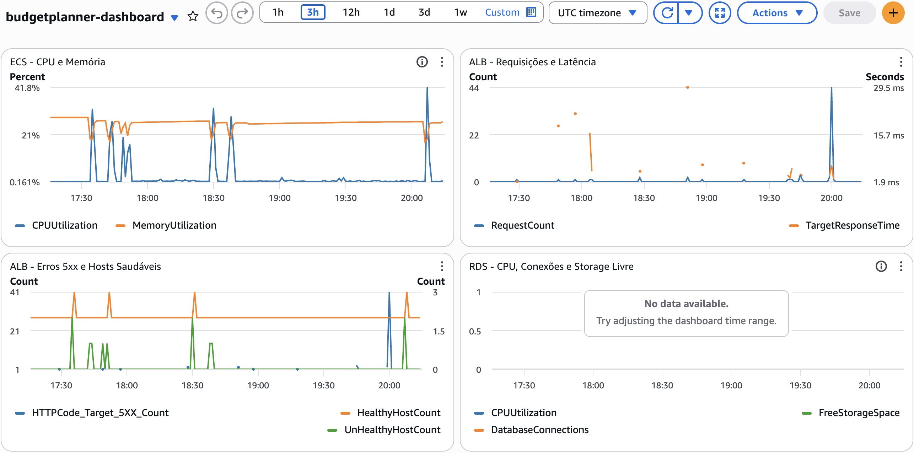

# Observabilidade - Budget Planner

Observabilidade via CloudWatch e SNS, provisionada em `infra/cloudwatch.tf`: logs do container, alarme de erros 5xx no ALB e um dashboard centralizando as métricas de ECS, ALB e RDS.

## Logs

Os logs do container (stdout/stderr) são enviados para um Log Group do CloudWatch (`aws_cloudwatch_log_group.budgetplanner_log_group`), referenciado no `logConfiguration` da task definition (`infra/ecs.tf`):

- Nome: `/ecs/budgetplanner`
- Retenção: 14 dias

Sem essa configuração, os logs só existiriam enquanto a task estivesse rodando, sendo perdidos a cada restart ou deploy.

## Alarme de erros 5xx

O alarme `aws_cloudwatch_metric_alarm.alb_5xx` monitora a métrica `HTTPCode_Target_5XX_Count` (namespace `AWS/ApplicationELB`) e dispara quando há mais de 5 respostas 5xx em um período de 1 minuto.

Pontos da implementação:

- As dimensões usam `arn_suffix` do load balancer e do target group, formato exigido pela métrica do ALB.
- `treat_missing_data = "notBreaching"` evita falso alarme quando não há tráfego no período avaliado.
- `ok_actions` notifica quando o alarme volta ao normal, sem precisar checar a console manualmente.

## Notificação via SNS

O alarme notifica o tópico SNS `aws_sns_topic.alarms`, que envia email para o endereço configurado na variável `alarm_email` (`infra/variables.tf`).

Após o `apply`, a AWS envia um email de confirmação de inscrição (subscription) para esse endereço. As notificações só são entregues depois que o link de confirmação é aceito.

## Dashboard

O dashboard `aws_cloudwatch_dashboard.budgetplanner` centraliza as métricas mais relevantes da infraestrutura em uma única tela:

- **ECS**: CPU e Memória do cluster/service.
- **ALB**: RequestCount e TargetResponseTime (latência).
- **ALB**: Erros 5xx, HealthyHostCount e UnHealthyHostCount.
- **RDS**: CPU, DatabaseConnections e FreeStorageSpace.

Acesso: AWS Console → CloudWatch → Dashboards → `budgetplanner-dashboard`.

## Custos

### Infraestrutura (Fargate, RDS, ALB, NAT Gateway)

Estimativa feita na [AWS Pricing Calculator](https://calculator.aws/#/addService), região `us-east-1`, para a configuração real deste projeto (2 tasks Fargate de 0.5 vCPU/1GB, RDS `db.t4g.micro` Single-AZ com 10GB, 1 ALB):

| Item | Custo mensal aproximado |
|---|---|
| AWS Fargate (2 tasks, 0.5 vCPU / 1GB, 730h) | US$36,04 |
| Amazon RDS for PostgreSQL (`db.t4g.micro`, 10GB) | US$13,98 |
| Elastic Load Balancing (1 ALB) | US$16,45 |
| NAT Gateway (taxa fixa, subnets privadas) | ~US$33,00 |
| **Total estimado** | **~US$99,50/mês** |

Esse valor não considera free tier: Fargate nunca teve cota gratuita, e RDS/ALB só têm 12 meses grátis em conta nova. O NAT Gateway é o item que mais passa despercebido nessa conta. Ele existe só para dar saída à internet para os recursos das subnets privadas (o ECS puxando imagem do ECR, por exemplo), cobra uma taxa fixa por hora independente do uso, e acaba sendo um dos itens mais caros da infra.

### Observabilidade (CloudWatch, SNS)

Esse custo é separado do de infraestrutura, e é bem menor:

| Item | Custo aproximado |
|---|---|
| Métricas nativas do CloudWatch (ECS, ALB, RDS) | Gratuitas |
| Logs (ingestão + armazenamento, retenção de 14 dias) | Centavos a poucos dólares/mês |
| Alarme (`alb_5xx`) | ~US$0,10/mês |
| SNS (notificações por email) | Gratuito até 1000 notificações/mês |
| Dashboard customizado | Gratuito (até 3 dashboards por conta) |

Somando só esses itens, a observabilidade fica abaixo de US$5/mês, e é adicional ao custo de infraestrutura, não um substituto dele.